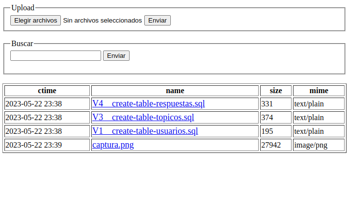

# phpshare
###  Un programa simple en PHP para compartir ficheros en la red local accediendo desde cualquier navegador WEB
### Requisitos
- PHP >= 7.4

## Como se ejecuta

$ git clone https://github.com/admred/phpshare.git

$ cd phpshare/

$ php -S 0.0.0.0:8000 

Se accede con el navegador, se debe conocer la ip local e ingresar con el navegador

Para acceder debe conocer la ip del equipo donde se ejecuta este script. En linux en una consola puede ejecutar: *ip addr* o *ifconfig*

## Captura de pantalla

	

### Problemas conocidos

Puede tener problemas para conectarse si tiene el firewall activado.

### Este servicio **no** es apto para uso fuera de la red local o LAN
