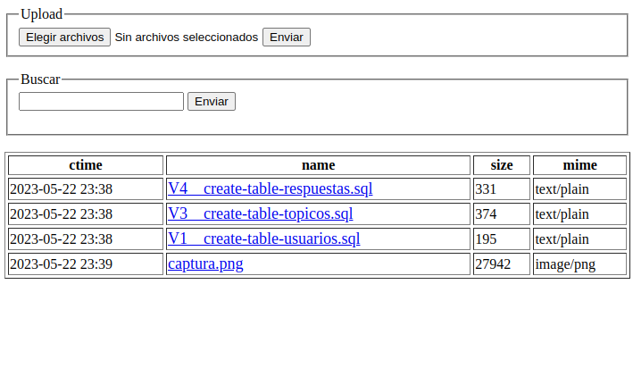

# phpshare

### [ES] Un peque&ntilde;o y divertido programa para compartir ficheros sobre la red local usando un navegador WEB.

### [EN] A small program to enable me pass files from phone to desktop with no pass for services of big corpos.

### Requisitos
- PHP >= 8.1

# Descargar codigo
$ git clone https://github.com/admred/phpshare.git

$ cd phpshare/

## Ejecutar

$ php -c user.ini -S 0.0.0.0:8080

## Ejecutar con Docker (recomendable)

# docker-compose up --build

## Captura de pantalla

	

